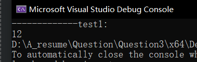

# 第一题：休闲游戏排⾏榜
## 1.1.运行结果：


## 1.2.时空复杂度分析：
快速排序采用分治思想，最好的情况下需要分区logn次，每次比较大小n次。时间复杂度最优为 O(nlogn)，最坏时间复杂度为 O(n^2)。
空间复杂度取决于递归栈的深度，O(logn)~O(n)

## 1.3.如果玩家数量达到数百万
思路1：数百万的情况下，可以选择堆排序直接找到前m个最大值。
思路2：将数据存储在数据库中，借助数据库的高效索引排序实现
思路3：将榜单的前1000名进行缓存。定时更新

# 第二题：魔法能量场
## 2.1.运行结果


## 2.2.时间复杂度分析
时间复杂度为 O(n);
空间复杂度为 O(n);
最坏情况下，数组中每个元素都会被访问一次.

## 2.3.思路：双指针（类似于力扣接雨水双指针思路）
我们从数组两端开始遍历，计算当前面积。
此时需要考虑要移动哪一个指针。
假设 *height[left] = min(height[left],height[right])*
显然移动小的。因为此时影响面积大小的主要因素是height[left]。移动 *left*尝试找到下一个面积更大值。

## 2.4.进阶挑战
### 2.4.1 如果我们允许玩家使⽤魔法道具来临时增加某个位置的塔的⾼度，你会如何修改你的算法？
* 笨方法：每次临时增加高度就重新计算。O(n)的时间复杂度不会很高
* 如何优化：暂时想不出来
### 2.4.2 在游戏的⾼级模式中，某些位置可能有建筑限制（⾼度为0）。你的算法如何处理这种情况？
* 因为每次都是移动高度小的边，这个逻辑可以处理该问题（这个问题也可能是我理解错了）

# 3. 魔法宝箱探险
## 3.1 运行结果
 

## 3.2 时空复杂度分析
* 空间复杂度为 O(n);
* 深度优先搜索：每次调用都可以导致两个子调用，为 *O(2^n)*
* 记忆化搜索和动态规划：时间复杂度为*状态个数 x 计算单个状态所需要的时间*。共有*n*个状态，计算单个状态只需要1次。故时间复杂度为*O(n)*

## 3.3 思路分析
动态规划经典入门问题。可以从回溯到记忆化搜索再到递推。
* 回溯：
定义 *dfs(i)* 表示从前 *i* 个宝箱中获得的最大价值。
如果选择第 *i* 个打开，则 *dfs(i) = dfs(i-2) + treasure[i]*
如果不选第 *i* 个打开，则 *dfs(i) = dfs(i-1)*
综上： *dfs(i) = max(dfs(i-2) + treasure[i], dfs(i-1))*
* 记忆化搜索
由于回溯进行了大量重复的计算，所以使用数组存储已经计算过的数值。若发现已经计算过，则直接返回，没有则计算并存储
* 递推：
*dfs(i) = max(dfs(i-2) + treasure[i], dfs(i-1))*
可一比一翻译为
*f[i] = max(f[i-2] + treasure[i], f[i-1])*
为防止数组越界访问，将给数组索引+2
*f[i+2] = max(f[i+1], f[i] + tr[i])*
参照回溯的返回逻辑
```
if (i < 0)
	return 0;
```
将加了2之后原本在-1、-2的位置初始化为0

## 3.4 进阶挑战
* 如果我们允许玩家使⽤⼀次"魔法钥匙"，可以安全地打开任意两个相邻的宝箱⽽不触发陷阱，你会如何修改你的算法？
定义 *dfs(i, key)* 表示：从前 i 个宝箱中，且有 key 个钥匙的情况下获得的最大价值。
则有
 *dfs(i, key) = dfs(i) = max(dfs(i-2, key) + treasure[i], dfs(i-1, key), dfs(i-1, key-1) + treasure[i])*。

 在边界条件中，添加对 *key* 的处理。若 *key < 0*, 则按原题返回，若大于0，则在添加上述处理。调试没有问题，再将代码改为更加高效的记忆化搜索以及动态规划递推。

* 在游戏的⾼级关卡中，有些宝箱可能包含负值（表⽰陷阱会扣除玩家的分数）。你的算法如何处理这种情况？

笨办法：不做处理，依然返回最大值
优化：逻辑修改为 *f[i + 2] = max(f[i + 1], (treasure[i] > 0 ? f[i] + treasure[i] : f[i]));*, 即碰见负值直接不选

## 3.5 创意思考
* 这个机制可能会在游戏中带来哪些有趣的策略选择？你能想到如何将这个概念扩展到⼀个完整的游戏关卡设计中吗？
或许可以在塔防游戏中，设置不同种类的兵种和给定的位置。不同的兵种放在相邻位置会有互斥或者相互增益的效果。供玩家自由组合

# 第四题 魔法天赋评估系统
## 4.1运行结果


## 4.2 时空复杂度分析：
n和m分别为两个数组的长度
* 时间复杂度：*O(n + m)*
* 空间复杂度：*O(n + m)*
## 4.3 思路分析
双指针
## 4.5 创意思考
这个天赋评估系统如何影响游戏的⻆⾊发展和技能学习机制？你能想到如何将这个概念融⼊到游戏的其他⽅⾯，⽐如任务系统或 PVP 对战中吗？
* 可以安排玩家做不同的任务增强相应的属性，属性积攒够了之后引入转职系统或技能树天赋树等等。pvp对战中可以引入属性的克制关系，玩家们可以根据自身对应属性的能力值获得不同强度的技能释放。


